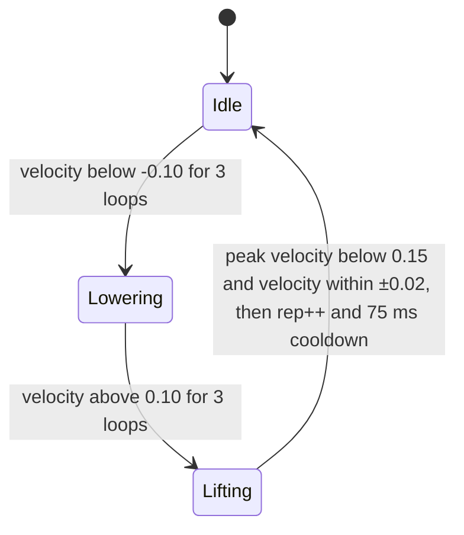

# Barbell Buddy

A bar-mounted device that counts reps and warns about left-right bar tilt in
real time during compound lifts (bench press, squat, deadlift). An ADXL345
accelerometer feeds an ATmega2560, which calibrates a level reference at
power-up, tracks tilt and bar velocity, counts reps with a state machine, and
gives feedback on LEDs and an LCD.

Built by a four-person team in a university embedded systems course
(Spring 2026).

   
  <em>Concept render</em>
  <!-- Replace with (or add) a photo of the built prototype: docs/prototype.jpg -->

## Why

Small left-right imbalances are hard to notice mid-set, repeated poor form
raises injury risk, and beginners often lack real-time coaching. Barbell Buddy
gives immediate, simple feedback without a coach or video.

## How it works

| Stage | Implementation |
| --- | --- |
| Sensing | ADXL345 3-axis accelerometer read over I2C (ATmega2560 = master) |
| Calibration | Current bar position is stored as the level zero reference at power-up or reset |
| Tilt feedback | Tilt angle is compared with thresholds; three LEDs (yellow / green / yellow, one lit at a time) show whether the bar is level or tilted past the threshold |
| Rep counting | Filtered acceleration is integrated to velocity; a state machine detects lowering and lifting phases |
| Display | LCD1602 in 4-bit mode shows the live rep count and status |
| Debug | UART prints sensor values and rep count to a serial monitor |
| Power | 9 V battery, power switch, reset button; about 80 to 125 mA, about 4 to 4.8 hours of runtime (estimated) |

### Rep-counting state machine

Requiring each condition for several consecutive loops filters accelerometer
noise, so a single spike cannot start or count a rep, and the cooldown
prevents double counting at the top of the lift.

## Firmware

Written in embedded C/C++ for the ATmega2560, organized into:

- **Timer:** millisecond delays for calibration, LCD timing and the main loop
- **I2C driver:** start/stop conditions, register reads and writes to the ADXL345
- **ADXL345 processing:** initialization, level calibration, acceleration reads, tilt angle
- **Tilt feedback:** threshold comparison and LED control
- **Rep counter:** acceleration filtering and the lifting/lowering state machine
- **LCD driver:** LCD1602 initialization (4-bit mode) and live rep count
- **UART debug:** serial output of sensor values and rep count

## Hardware

| Component | Qty | Est. cost |
| --- | --- | --- |
| Arduino Mega 2560 | 1 | $18.00 |
| Arduino Mega Proto Shield Rev3 (PCB) | 1 | $6.20 |
| ADXL345 IMU | 1 | $8.00 |
| LCD1602 display | 1 | $6.00 |
| Toggle switch | 1 | $1.50 |
| Push button | 1 | $0.25 |
| 9 V battery + clip | 1 | $3.00 |
| LEDs, resistors, wire | 1 set | $3.00 |
| Black PLA filament (150 g) | 1 | $3.50 |
| Mounting materials (magnetic tape, velcro) | 1 set | $0.70 |
| **Total** | | **$50.15** |

### Enclosure

A 3D-printed enclosure with a curved saddle that mounts on the bar, a window
for the LCD, and openings for the LEDs, switch and reset button.

  
  

## Requirements and verification

| Requirement | How it was verified |
| --- | --- |
| Measure bar tilt within ±2° of the true angle | Device output compared with known test angles |
| Calibrate to a level starting position at power-up | Startup position confirmed as the zero reference |
| Warn when tilt exceeds a chosen threshold | Bar tilted past the threshold; LED/LCD warning confirmed |
| Run continuously through repeated sets | Multiple test sets run without reset or disconnect |

## Results

**Working:** power-up and system operation, IMU data acquisition over I2C,
LED warnings tracking tilt, LCD feedback, rep counting with consistent timing,
and the integrated prototype in its mountable enclosure.

**Still improving:** tilt threshold tuning, and enclosure fit and internal
component stability.

**Limitations:** the IMU is a single point of failure (all feedback depends on
it); accuracy depends on calibration; sensor drift can affect tilt; battery
power limits runtime; mounting stability affects consistency.

## Next steps

- Tune thresholds and calibration for better accuracy
- Improve enclosure retention and mechanical stability
- Continue refining rep-counting logic
- Show a set summary on the LCD (rep count and average tilt) after each set

## Team

Ben Bohan, Lucius Casertano, Vasu Kedia, Micah Case.
